# Olá! Eu sou o Thiago Freitas 👋

🎓 Estudante de **Engenharia de Software na FIAP**  
💻 **Software Developer | Full Stack**  
💼 Experiência profissional em tecnologia no **Bradesco**  
🚀 Interesse em desenvolvimento de software, aplicações Full Stack e automação

Atualmente, venho direcionando minha formação e meus projetos para o desenvolvimento de software, buscando evoluir continuamente minhas habilidades técnicas e construir soluções eficientes e escaláveis.

---

## 🛠️ Tecnologias

### 💻 Desenvolvimento

 
  
  
  
  
  
  
  
  
  

### 📊 Dados & Automação

**Python • SQL • Power BI • Power Apps • Power Automate • Databricks**

### 🔧 Ferramentas

 
  
  
  

---

## 💼 Experiência

Minha experiência profissional em tecnologia envolve:

- Python e SQL para tratamento e análise de dados
- Desenvolvimento de dashboards e relatórios em Power BI
- Desenvolvimento de soluções com Power Apps e Power Automate
- Automação e integração de processos e dados
- Mapeamento de processos, riscos e controles de Tecnologia e Segurança da Informação
- Desenvolvimento de projetos e aplicações Full Stack

---

## 🚀 Desenvolvimento

Tenho experiência e interesse no desenvolvimento de aplicações envolvendo:

- **Front-end:** React.js, JavaScript, HTML e CSS
- **Back-end:** Node.js, Java e Kotlin
- **Banco de dados:** MySQL e bancos relacionais e não relacionais
- **Automação:** Python, Power Automate e Power Apps
- **Integração:** APIs, dados e diferentes tecnologias
- **Versionamento:** Git e GitHub

---

## 📊 GitHub Stats

  
  

---

## 🐍 Contributions

<picture>
  <source media="(prefers-color-scheme: dark)" srcset="https://raw.githubusercontent.com/Thiago1223/Thiago1223/output/github-snake-dark.svg">
  <source media="(prefers-color-scheme: light)" srcset="https://raw.githubusercontent.com/Thiago1223/Thiago1223/output/github-snake.svg">
  
</picture>

---

## 📫 Contato

  
  

---

⭐ Sinta-se à vontade para explorar meus repositórios e projetos.
